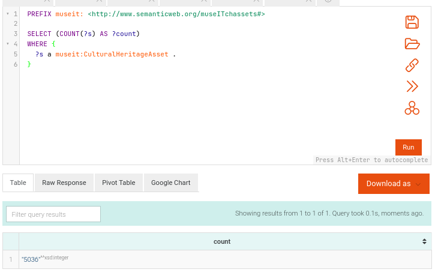
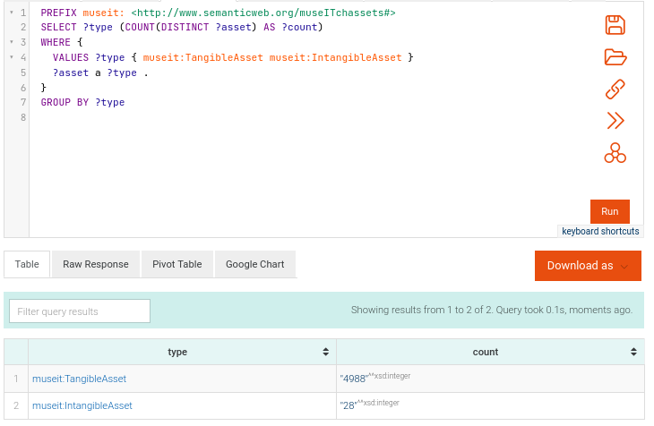
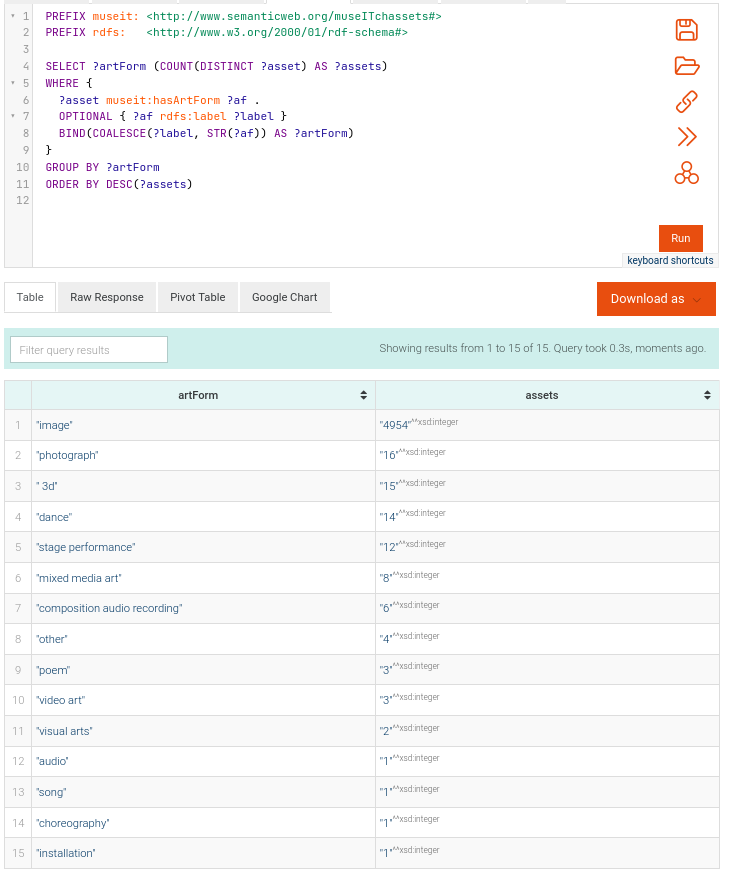
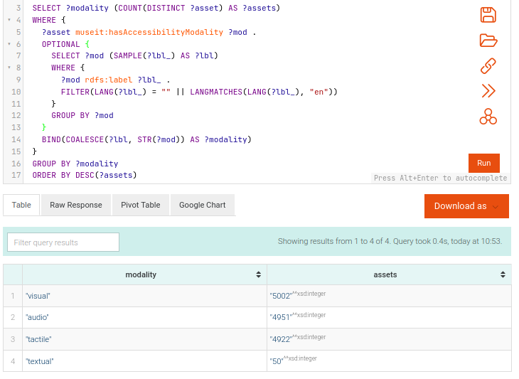
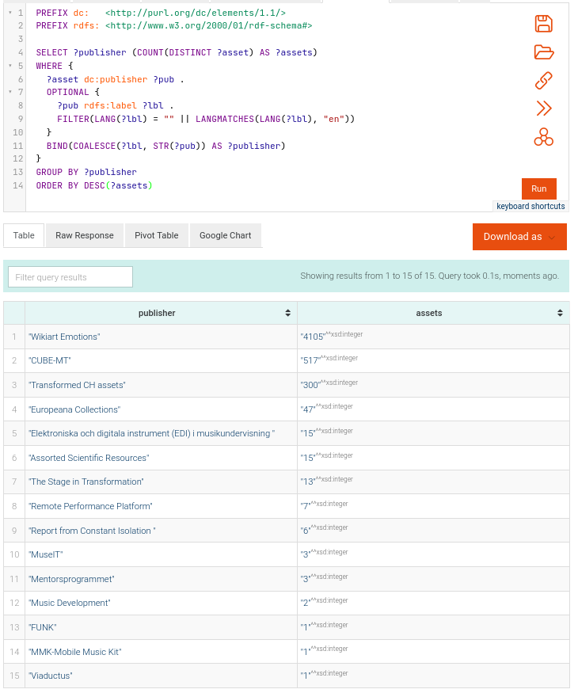
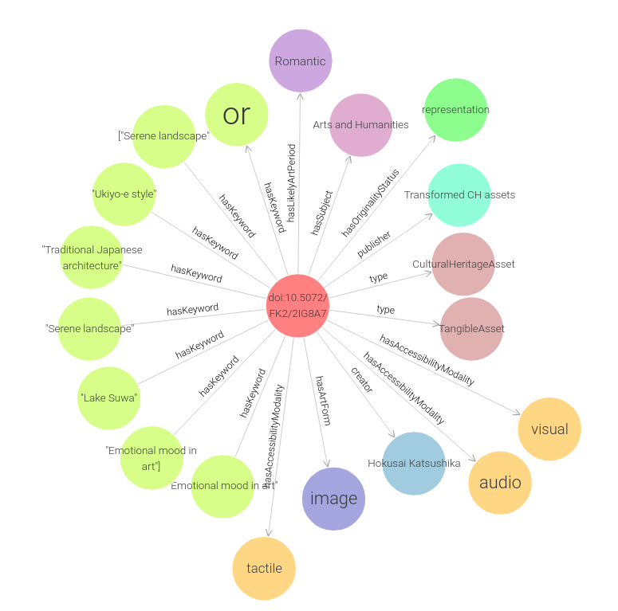

# MuseIT Cultural Heritage Knowledge Graph (MuseIT KG) - v2.0

**Overview**
The MuseIT KG  is a curated RDF dataset representing Cultural Heritage Assets (CHAs).  
It integrates metadata published by partners in Dataverse with a MuseIT domain ontology that reuses DCMI and FOAF while introducing MuseIT-specific classes and properties.

**Purpose & scope**
- Provide a semantic backbone for MuseIT assets across tangible and intangible domains.  
- Ensure interoperability via selective reuse of external vocabularies (DCMI, FOAF).  
- Support automated ingestion & synchronization from partner Dataverse instances.  
- Enable descriptive analytics, discovery, and downstream applications (e.g., MuseMeUp, recommendation systems, accessibility tooling).  

---

## Example Analytics (SPARQL query results)

### 1. Total Assets 

### 2. Tangible vs. intangible

### 3. Distribution by art form

### 4. Distribution by modality

### 5. Assets per publisher

---

## Example Asset Visualization
Below is a graph representation of one Cultural Heritage Asset and its linked metadata:

